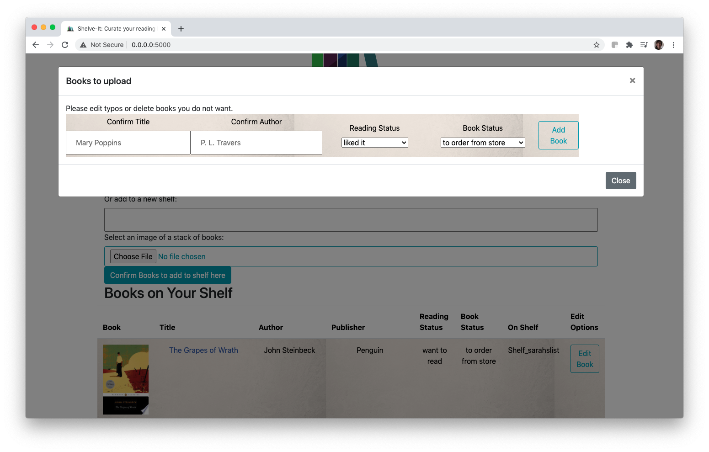
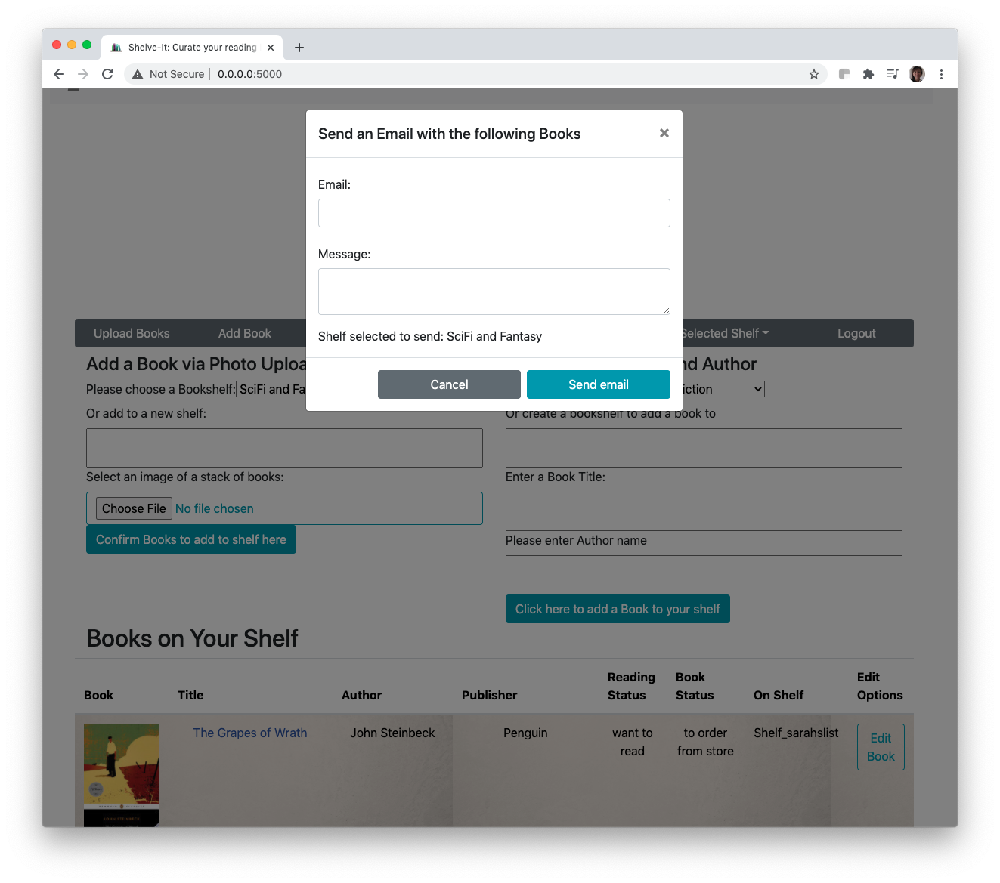
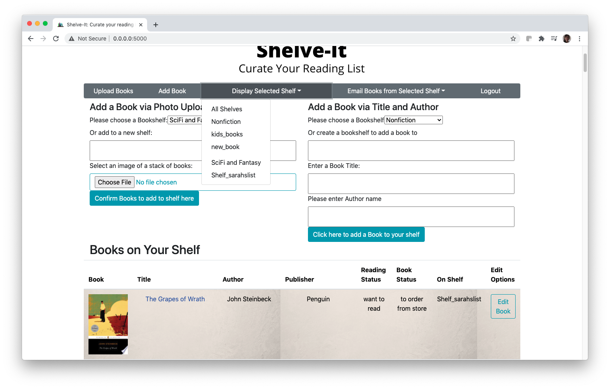

<!-- THANKS TO https://github.com/othneildrew/Best-README-Template/blob/master/README.md for the README template!]>

<!-- PROJECT SHIELDS -->
<!--
*** I'm using markdown "reference style" links for readability.
*** Reference links are enclosed in brackets [ ] instead of parentheses ( ).
*** See the bottom of this document for the declaration of the reference variables
*** for contributors-url, forks-url, etc. This is an optional, concise syntax you may use.
*** https://www.markdownguide.org/basic-syntax/#reference-style-links
-->

[![LinkedIn][linkedin-shield]][linkedin-url]
 
  
  
  <!-- PROJECT LOGO -->
<br />
<p align="center">
    


  <h3 align="center">Shelve-It, Curate Your Reading Lists</h3>

  <p align="center">
  This web-app lets you upload a photo of a stack of books and add them to a virtual bookshelf. 
    <br />
    <a href="https://github.com/shhudspeth/hb-project-shelve-it"><strong>Explore the docs »</strong></a>
    <br />
    <br />
    <a href="https://youtu.be/ZxeXyDhHanE">View Demo</a>
    ·
    <a href="https://github.com/shhudspeth/hb-project-shelve-it/issues">Report Bug</a>
    ·
    <a href="https://github.com/shhudspeth/hb-project-shelve-it/issues">Request Feature</a>
  </p>
</p>


<!-- TABLE OF CONTENTS -->
## Table of Contents

* [About the Project](#about-the-project)
  * [Built With](#built-with)
* [Getting Started](#getting-started)
  * [Prerequisites](#prerequisites)
  * [Installation](#installation)
* [Usage](#usage)
* [Roadmap](#roadmap)
* [Contributing](#contributing)
* [License](#license)
* [Contact](#contact)
* [Acknowledgements](#acknowledgements)


<!-- ABOUT THE PROJECT -->
## About The Project

[![Shelve-It Screen Shot][product-screenshot]](https://shelve-it.com)

Curate your reading needs. Track your reading lists. This web-app lets you upload a photo of a stack of books. Organize books by shelves, reading status, or to borrow status. See information on a book and leave a comment. Email your bookshelves to yourself or friends. See a list of nearby libraries and bookstores based on your zip-code. Shelve-It, here to help you track and curate your reading needs.

### Built With
Shelve-It uses:
* [PostgreSQL]
* [SQLAlchemy]
* [Python]
* [Pillow]
* [Flask]
* [React]
* [Handlebars.js]
* [BeautifulSoup4]
* [Bootstrap](https://getbootstrap.com)

And the following APIs:
* [GoogleBooksApi]
* [GoogleCloudVisionAPI]
* [GooglePlaces]
* [SendGrid]
* [GeoCoder]


<!-- GETTING STARTED -->
## Getting Started

Shelve-It is deployed on an AWS LightSail Instance. Please go to Shelve-It.com to test it out. If you would like to deploy locally, follow the below steps. 

### Prerequisites

Make sure your pip is updated and you are running Python 3.6 or greater. 


### Installation

1. Get a free API Key at [https://developers.google.com/maps/documentation/javascript/get-api-key](https://developers.google.com/maps/documentation/javascript/get-api-key)
2. Clone the repo
```sh
git clone https://github.com/shhudspeth/hb-project-shelve-it/
```
3. Install requirements.txt
```sh
pip3 install -r requirements.txt
```
4. Enter your API key and SendGrid key in `secrets.sh`
```sh
source secrets.sh
```


<!-- USAGE EXAMPLES -->
## Usage

Below are instructions and main features of Shelve-It. 

<ol>
  <li> Uploading a Bookshelf </li>
  
  <li> Making a Bookshelf </li>

  <li> Add a Book to a Bookshelf </li>
  <li> Email a Bookshelf </li>
  
  <li> Display by a Shelf </li>
  
  <li> Add or View Comments by a Book </li>
</ol>


<!-- ROADMAP -->
## Roadmap
-- coming soon! --
See the [open issues](ttps://github.com/shhudspeth/hb-project-shelve-it/issues) for a list of proposed features (and known issues).


<!-- CONTRIBUTING -->
## Contributing

Contributions are what make the open source community such an amazing place to be learn, inspire, and create. Any contributions you make are **greatly appreciated**.

1. Fork the Project
2. Create your Feature Branch (`git checkout -b feature/AmazingFeature`)
3. Commit your Changes (`git commit -m 'Add some AmazingFeature'`)
4. Push to the Branch (`git push origin feature/AmazingFeature`)
5. Open a Pull Request


<!-- LICENSE -->
## License

Distributed under the MIT License. See `LICENSE` for more information.


<!-- CONTACT -->
## Contact

Your Name - [@sarahhhuds](https://twitter.com/sarahhhuds) - sarah@shelve-it.com

Project Link: [https://github.com/shhudspeth/hb-project-shelve-it/](https://github.com/shhudspeth/hb-project-shelve-it/)


<!-- ACKNOWLEDGEMENTS -->
## Acknowledgements
* [GitHub Emoji Cheat Sheet](https://www.webpagefx.com/tools/emoji-cheat-sheet)
* [Img Shields](https://shields.io)
* [Choose an Open Source License](https://choosealicense.com)
* [ReadMe Template](https://github.com/othneildrew/Best-README-Template/blob/master/README.md)


<!-- MARKDOWN LINKS & IMAGES -->
<!-- https://www.markdownguide.org/basic-syntax/#reference-style-links -->

[linkedin-shield]: https://img.shields.io/badge/-LinkedIn-black.svg?style=flat-square&logo=linkedin&colorB=555
[linkedin-url]: https://linkedin.com/in/shhudspeth
[product-screenshot]: static/images/product-screenshot.png
